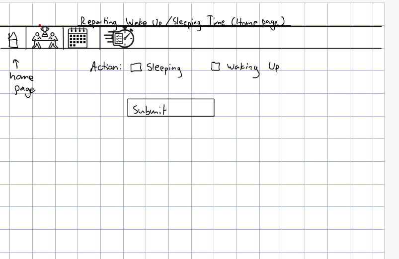
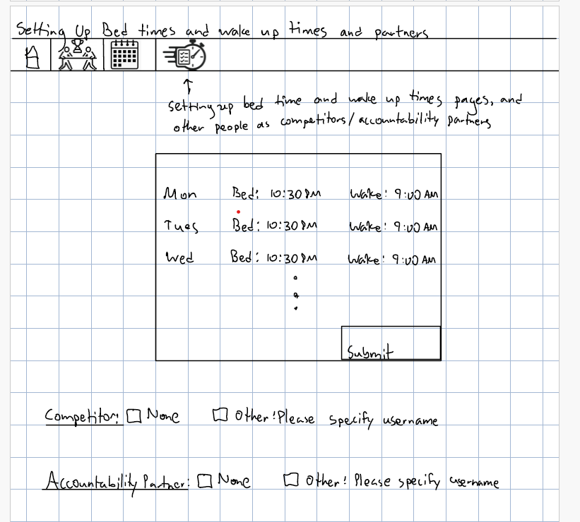
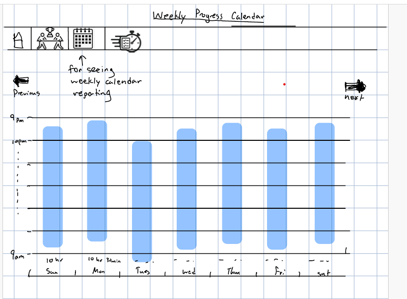

# Assignment 2- Functional Design

# **Domain 1: Self-improvement and accountability**
Self improvement is on the rise with many ambitious people seeking out ways to improve themselves. On social media many influencers are gaining supporters for their self improvement tips and motivation. However, technology can be used to help users apply self improvement practically and with accountability from other trusted people. I myself, am always trying to find how to improve myself as a student, family member, and person as a whole so this domain greatly interests me.

## **Selected problem: Unhealthy sleep schedules**

Problem description: It is very difficult to maintain a healthy and consistent sleep schedule when juggling many responsibilities. College for instance is an environment that often makes it difficult to have adequate sleep schedules as there are many deadlines and extracurricular responsibilities to juggle.

### **Stakeholders**

- **Primary user who interacts with app**:
  The user is someone who struggles with keeping good sleep hygiene. They likely are juggling many responsibilities or lack discipline and need assistance in tracking and maintaining a good sleep schedule.

- **Accountability partner**:
  The accountability partner is someone who likely cares for the primary user. They would benefit from the primary user having better sleep hygiene as this is beneficial for their health. Additionally, many people are irritable when sleep deprived so the accountability partner may experience this in their relationship with the primary user.

- **Roommates**:
  Living with others who have poor sleeping habits can be challenging especially when the primary user is awake at very late hours, and therefore unintentionally causing disruptions to roommates' sleep with lights being on and noise being made.

### **Evidence**
**Importance/Scope of Problem:**
- [Sleep deprivation in higher education:](https://en.wikipedia.org/wiki/Sleep_deprivation_in_higher_education)
  Among college students, sleep deprivation is notably high, with approximately 70% reporting insufficient sleep and 50% experiencing daytime sleepiness. On average, students obtain only 5.7 hours of sleep per night, often resorting to multiple "all-nighters" each month.

- [Insufficient Sleep:](https://odphp.health.gov/healthypeople/objectives-and-data/browse-objectives/sleep)
  Roughly 1 in 3 adults, and even more in adolescents, don’t get sufficient sleep, once again highlighting how widespread this problem is. Insufficient sleep can lead to health problems like obesity, diabetes, heart disease, stroke, dementia, and cancer, showing the importance of solving this problem.

**Comparables:**
- [Pillow:](https://pillow.app/)
  An app that has very detailed analysis of one’s sleep with helpful diagrams, and the app helps users uncover the “scientifically proven benefits of great sleep”. The limitation of this app is that it doesn’t incorporate the idea of having an accountability partner who can get insights into the primary user’s sleep habits. Passive tracking may cause the user to be less aware of their poor sleeping habits.

- [bettersleep](https://www.bettersleep.com/)
  An app that helps users fall asleep faster with music, meditations, and stories backed by the science of sleep. Helpful for users who find it difficult to sleep at earlier hours. However, a limitation is that it doesn’t really solve the issue of poor sleeping habits as its users are those who are attempting to sleep not avoiding sleep.

- [Sleep Cycle](https://sleepcycle.com/)
  This app, like others, provides great sleep stage tracking; however, it only provides users with information for healthy sleep habits and doesn’t bring in an accountability partner. Once again, passive tracking without much of the user’s input can lead to lack of awareness of one’s poor sleeping habits.

### **Features**
1. **Set bedtime and wake up times:**
- Set a bedtime and get notifications with reminders to wind down if near/exceeded that time. Also, users can set a wake up time, and the user would need to log into the app within five minutes of the wake up time to prove they have woken up. Setting a consistent bedtime and wake up time stabilizes ones’ circadian rhythms which improves the quality of sleep.
2.  **Notify Accountability Partners:**
- If the primary user sleeps past their bed time, email/message the accountability partner the user has requested. Accountability from others greatly helps the primary user stay on track with their sleep schedule when their intrinsic motivation lacks, and their accountability partner will be in the know in terms of the primary user’s progress as a summarized report will be reported to the accountability partner weekly.
3. **Friendly Competition:**
- Every week you can compare “sleep stats” with a partner and see who wins. Stats would include how many days the bed time and wake up time was followed, average number of hours slept per night, etc. This is similar to the accountability partner in adding more extrinsic motivation to help the problem of lacking proper sleep hygiene.

## **Application Pitch: ShutEye Showdown**

It is difficult for busy students and young adults to maintain a consistent, healthy sleep schedule amidst competing responsibilities, leading to widespread sleep deprivation and its negative health, academic, and social impacts.

**Feature 1: Bedtime & Wake Alerts**
ShutEye Showdown allows you to set consistent bedtime and wake-up goals. This steady routine helps reset your circadian rhythm, leading to deeper sleep and more energy during the day. Roommates also benefit from fewer late-night disruptions caused by irregular hours or inconsistent quiet time when your sleep schedule is constantly changing.

**Feature 2: Accountability Partner Notifications**
When personal discipline slips, accountability can make the difference. If you stay up too late, ShutEye Showdown will notify your chosen accountability partner, and a short weekly report will keep them updated on your progress. This not only motivates you to stick to your schedule but also allows partners to support and encourage healthier habits.

**Feature 3: Sleep Competitions**
To keep motivation high, ShutEye Showdown adds a lighthearted competitive edge. Each week you and your accountability partner compare sleep stats like number of times you abided by your bed time and wake up times. Turning sleep into a friendly challenge makes progress fun and reinforces the commitment to long-term change. This allows for external motivation for the primary user.

# Concept Creation
1. **concept** SleepSchedule [User]

- Purpose:
Let users set bedtime/wake goals, log sleep and wake events, and record daily adherence (did the user follow their targets).

- Operational Principle:
Users set bedtime and wake targets. When the app receives sleep/wake logs, the concept computes whether the user met the bedtime/wake targets for that date and records adherence. Missed-adherence events are tracked for notifications/reports.

- State:

    - A set of SleepSlots with:

        - bedtime: Time

        - waketime: Time

        - a user: User

        - date: Date

    - a set of adherenceLogs with:
        - user: User
        - date: Date
        - success:Boolean

- Actions:
    - addSleepSlot(u: User, bedTime:Time, wakeTime: Time, date)
        - requires: user u exists and every date not in SleepSlots

        - effect: creates a SleepSlot with the user, bedTime, wakeTime, and date

    - removeSleepSlot(u:User, date):
        - requires: there exists a SleepSlot with user u and set of Date, dates
        - removes this SleepSlot

    - reportBedTime(u:User, t:Time, d:Date): Boolean
        - requires: SleepSlot with u:User and d:Date exists
        - effect: set success= t < the bedtime in SleepSlots and return success

    - reportWakeUp(u:User, t:Time, d:Date):Boolean
        - requires: SleepSlot with u:User and d:Date exists
        - effect: set success= t < the wakeTime in SleepSlots and return success

    - recordAdherence (u:User, d:Date, success:Boolean):
        - set succes in adherenceLog with user u and date d to passed in success

2. PasswordAuth concept
- **concept** PasswordAuth
- **purpose** limit access to known users and establish point of contact
- **principle** after a user registers with username, password, and establishes an email they can authenticate with that same username and password and be treated as the same user. Can also be contacted with the provided email address.
- **state**
    - a set of Users with:
        - a username:Strong
        - an email: String
    - a set of Credentials with:
        - username: String
        - password: String
        - user: User
- **actions**
    - register(username:String, password:String, email:String): (user:User)
        - **requires**: no user exists with username and no credential exists with username
        - **effects**: creates a new User with username and email

    - authenticate(username: String, password: String): (user:User)
        - **requires**: there exists a Credential with username and password
        - **effects**: returns the corressponding user

3. Accountability conecpt
- **concept** Accountability [User]
- **purpose** Inform accountability partners when a user fails to meet their schedule, using their registered email addresses.
- **principle**  After a user designates a partner, whenever an adherence failure is recorded for a date, a notification for that partner is sent
- **state**
    - a set of Partnerships with
        - a user:User
        - a partner:User
- **actions**
    - addPartner(user:User, partner:User):
        - **requires**: user and partner are not equal and (user, partner) is not in Partnerships
        - **effects**: add user and partner to Partnerships
    - removePartner(user: User, partner:User)
        - **requires**: user and partner is not in Partnerships
        - **effects**: remove the pairing user, partner in Partnerships
    - notify(partner:User, message: String)
        - **effects**: emails ther partner with message

4. Competition[User] concept:
- **concept** Competition[User]
- **purpose** Allow users to engage in friendly weekly competitions that compare their adherence and sleep habits with a chosen partner.
- **principle** After two users agree to a challenge, the app records their weekly adherence statistics (derived from their SleepSchedules) and produces a weekly outcome (winner, loser, or tie).
- **state**
    -a set of Competitions with:
        - user: User
        - challenger: User
        - startDate: Date
        - endDate: Date
        - a set of userStats with
            - user: User
            - date: Date
            - score: Number
- **actions**
    - startCompetition(user:User, challenger:User, start:Date, end:Date)
        - **requires**: user is not the challenger and no overlapping Competition already exists
        - **effects**: create a Competition with a set of userStats for each user from start to end dates and with scores = 0
    - recordState(u:User, d:Date, deltaScore:Number)
        - **requires**: u is part of a Competition and d is within startDate and endDate of that Competition
        - **effects**: add a userStat to the set of userStats with user=u, date=d, and score= score+deltaScore
    - endCompetition(c:Competition): status:Number
        - **requires**: current date is greater than or equal to the endDate of Competition
        - **effects**: return the outcome of who won by aggregating the scores of the user and challenger, where 0 represents user winning, 1 represents challenger winning, and 2 represents a tie

## Syncs:
**Authentication control**
- **when** SleepSchedule.addSleepSlot(u:User, bedTime: Time, wakeTime: Time, date)
- **where** PasswordAuth.authenticate(username, password) == u
- **then** allow

**BedTime reported Failure -> Notification**
- **when** SleepSchedule.reportBedTime(u:User, t:Time): (success:Boolean)
- **where** success == false and (u, p:User) are in Accountability.Partnerships
- **then**
    - Accountability.notify(u, "Your partner missed their bedtime")
    - Competition.recordStat(u:User, d:Date, -1)

**WakeUp reported Failure -> Notification**
- **when** SleepSchedule.reportWakeUp(u:User, t:Time): (success:Boolean)
- **where** success == false and (u, p:User) are in Accountability.Partnerships
- **then**
    - Accountability.notify(u, "Your partner missed their wake up time")
    - Competition.recordStat(u:User, d:Date, -1)

**BedTime reported Success -> Challenge stat update**
- **when** SleepSchedule.reportBedTime(u:User, t:Time): (success:Boolean)
- **where** success == true
- **then**: Competition.recordStat(u:User, d:Date, 1)

**Wake up reported Success -> Challenge stat update**
- **when** SleepSchedule.reportBedTime(u:User, t:Time): (success:Boolean)
- **where** success == true
- **then** Competition.recordStat(u:User, d:Date, 1)

**Competition end date passes->Outcome**
- **when** endDate passed for Competition c
- **then** Competition.endCompetition(c)

## Brief Note on Concept Roles in ShutEye Showdown

The four concepts together deliver the core functionalities of ShutEye Showdown while maintaining separation of concerns. PasswordAuth is the entry point: it manages registration and authentication of users and ensures that only known users can access sleep data or participate in competitions. The User type bound here provides the generic user parameter for the other three concepts. The inclusion of an email in registration allows for notifying accountability partners.

SleepSchedule [User] is the central concept for setting and enforcing bedtime/wake goals. It records daily adherence outcomes (success/failure) based on user logs. These adherence logs form the foundation for both accountability notifications and competition scoring. Importantly, SleepSchedule only manages a user’s own targets and results, not partners in Competitions or Accountability.

Accountability [User] builds on this by allowing users to nominate accountability partners. Its state links pairs of users, and its notify action enables direct communication to partners. Synchronizations connect adherence failures in SleepSchedule with partner notifications, ensuring accountability flows outward but without cross-contaminating state between concepts.

Competition [User] provides structured, weekly challenges. It tracks start and end dates, maintains per-user scores, and produces outcomes at the end of each competition. Synchronizations connect adherence outcomes from SleepSchedule to scoring in Competition, incrementing or decrementing scores appropriately. This adds an element of external motivation and accountability which differentiates this sleep tracking app from comparables.

In conclusion, PasswordAuth secures the system and defines users, SleepSchedule manages sleep goals and adherence, Accountability manages interpersonal notifications, and Competition transforms adherence data into friendly contests. The generic type parameter User is bound consistently to the users managed by PasswordAuth.

# Sketches
## Home page and reporting wake up/sleep time:

## Competition page

## Setting Up Wake up/Bed times and accountability partners + competitors

## Weekly progress page

# User Journey Narrative: Alex and ShutEye Showdown

**Problem trigger:**
Alex is a college student who often stays up until 2 AM finishing assignments. His irregular schedule leaves him exhausted in morning classes and irritable with his roommates. After oversleeping and missing another lecture, Alex realizes he needs help establishing a healthier routine. He realizes that he also finds it easier to stick to goals when held accountable by others so he wants others to assist him on his journey to improving sleep habits.

1. Step 1 – Setting a routine and accountability partners (UI: Bedtime/Wake setup page)
Alex opens ShutEye Showdown and navigates to the “Setting Up Bedtimes and Wake-up Times” page
He enters his goals: bedtime at 10:30 PM and wake-up at 9:00 AM for weekdays, and 11:00 PM to 10:00 AM on weekends. He taps Submit, and the app confirms that his new routine is saved. This gives Alex a clear, structured starting point for improving his sleep hygiene. He also includes a competitor (his roommate), and an accountability partner (his Mom).

2. Step 2 – Daily logging (UI: Reporting Homepage)
That night, before putting his phone away, he goes to the Reporting Homepage to report he is sleeping he slept after 10:30 PM. So his mom was notified that he went past his bedtime and he lost points in his competition agains his roommate. In the morning, when his alarm rings at 9:00 AM, he opens the same page and logs “Waking Up.”

3. Step 3 – Accountability & competition (UI: Competition Page)
Midweek, Alex checks the Competition Page, where he’s paired with his roommate. He sees both of their scores updated from their daily logs. For Monday and Tuesday, Alex followed his schedule and earned points, while his roommate missed one wake-up and fell behind. The “Store Breakdown” table by day makes it easy for Alex to visualize his consistency. This friendly rivalry motivates him to keep going.

4. Step 4 – Reviewing progress (UI: Weekly Progress Calendar)
At the end of the week, Alex looks at the Weekly Progress Calendar. Which visually shows his sleeping and waking up times to get a quick glance at his progress for the week.

Outcome:
After two weeks, Alex notices big changes: he’s falling asleep earlier, waking up on time, and showing up to class more alert. His roommate also benefits from quieter evenings. The bedtime/wake setup, daily reporting, and competition tracking combine to transform sleep from a vague goal into a structured, accountable habit—exactly what Alex needed to get back on track.
